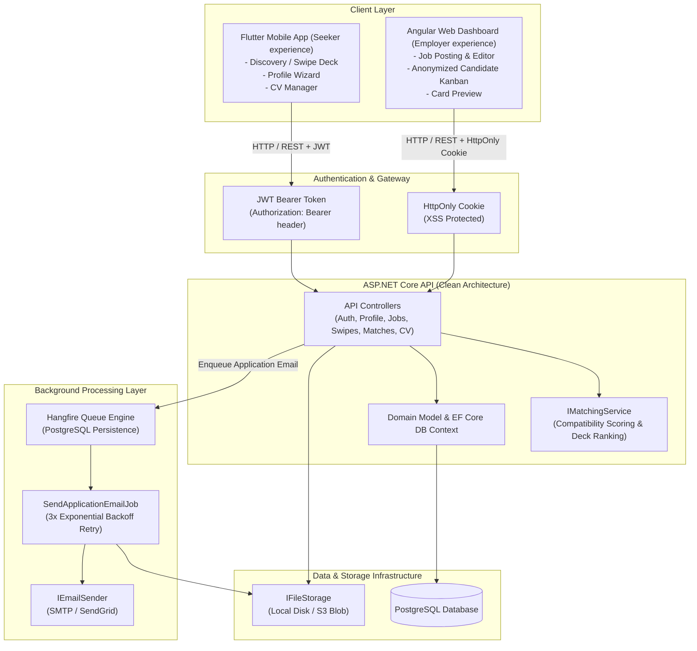
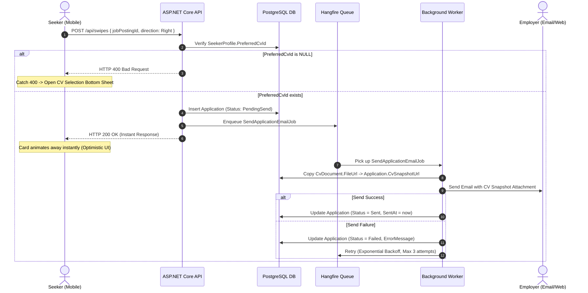
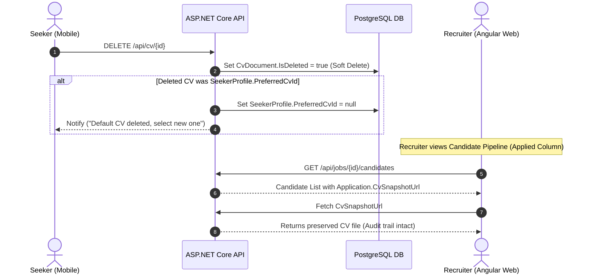

# Stackt System Architecture & Component Specification

This document provides a comprehensive technical architecture synthesis for **Stackt** — a job search platform combining TikTok-style swiping with Tinder-style mutual matching.

---

## Executive Summary & System Overview

Stackt connects job seekers and recruiters through a mobile-first swipe discovery interface and a recruiter candidate pipeline dashboard, backed by an ASP.NET Core microservices architecture.

### Unified System Architecture Diagram (Mermaid)



### High-Level System Architecture (ASCII Diagram)

```
+-----------------------------------------------------------------------------------+
|                                 STACKT SYSTEM                                     |
+-----------------------------------------------------------------------------------+
|                                                                                   |
|  [ Flutter Mobile App ]                         [ Angular Web Dashboard ]         |
|  (Seeker Experience)                            (Employer Experience)             |
|  - Swipe Card Deck (Optimistic UI)              - Job Management & Form           |
|  - Profile Setup Wizard                         - Card Preview Component          |
|  - CV Manager (Generate/Upload)                 - Candidate Pipeline (Kanban)     |
|         |                                              |                          |
|         | JWT Bearer Token                             | HttpOnly Cookie          |
|         v                                              v                          |
|  +-----------------------------------------------------------------------------+  |
|  |                       ASP.NET CORE WEB API SERVICES                         |  |
|  |                                                                             |  |
|  |  +-------------------+   +--------------------+   +----------------------+  |  |
|  |  | AuthController    |   | ProfileController  |   | JobsController       |  |  |
|  |  +-------------------+   +--------------------+   +----------------------+  |  |
|  |  | SwipesController  |   | MatchesController  |   | CvController         |  |  |
|  |  +-------------------+   +--------------------+   +----------------------+  |  |
|  |                                                                             |  |
|  |  +-----------------------------------------------------------------------+  |  |
|  |  | IMatchingService (Score = Skill 50% + Salary 25% + Style 15% + Exp 10%) |  |  |
|  |  +-----------------------------------------------------------------------+  |  |
|  +--------------------------------------+--------------------------------------+  |
|                                         |                                         |
|                    +--------------------+--------------------+                    |
|                    |                                         |                    |
|                    v                                         v                    |
|  +----------------------------------+   +--------------------------------------+  |
|  |  PostgreSQL Database              |   |  Hangfire Background Job Processing  |  |
|  |  - User, Seeker, Employer        |   |  - Persistent Application Queue      |  |
|  |  - JobPosting, Swipe, Match      |   |  - SendApplicationEmailJob           |  |
|  |  - CvDocument, Application       |   |  - Immutable CV Snapshot Copying    |  |
|  +----------------------------------+   +--------------------------------------+  |
|                                                              |                    |
|                                                              v                    |
|                                                 +------------------------------+  |
|                                                 | External Services            |  |
|                                                 | - IEmailSender (SMTP/Grid)   |  |
|                                                 | - IFileStorage (Disk/S3)     |  |
|                                                 | - ICvGenerator (QuestPDF)    |  |
|                                                 +------------------------------+  |
|                                                                                   |
+-----------------------------------------------------------------------------------+
```

---

## Component Deep Dive

### 1. Backend (`HuntBackEnd` / ASP.NET Core API)

* **Primary Purpose & Scope:**
  Serves as the central backend API and business logic hub for job matching, candidate deck ranking, CV handling, and async email application distribution. Implements Clean Architecture (`Domain`, `Application`, `Infrastructure`, `Api`).

* **Core Responsibilities:**
  * **Identity & Security:** JWT generation and claim validation for `Seeker` and `Employer` roles.
  * **Compatibility Scoring (`IMatchingService`):**
    Evaluates job postings against seeker profiles using the weighted MVP formula:
    $$\text{Score} = (\text{SkillOverlapRatio} \times 0.50) + (\text{SalaryFit} \times 0.25) + (\text{WorkStyleMatch} \times 0.15) + (\text{ExperienceLevelMatch} \times 0.10)$$
    Filters out previously swiped jobs and returns candidate cards with score > 0.5 threshold.
  * **CV Lifecycle & Immutable Application Snapshots:**
    Generates PDF CVs from profile data (`QuestPDF`), manages user uploads, soft-deletes CVs (`IsDeleted = true`), and creates immutable snapshots (`CvSnapshotUrl`) at application time to protect audit history against file deletion.
  * **Asynchronous Auto-Apply Pipeline:**
    Receives right swipes, verifies active preferred CVs, creates `Application` records (`PendingSend`), and dispatches email tasks to Hangfire.

* **Key Database Schema Constraints:**
  * `Swipe`: Unique constraint on `(UserId, JobPostingId)` to prevent duplicate swipes.
  * `Application`: Unique constraint on `(SeekerId, JobPostingId)` to prevent duplicate email transmissions for the same role.

* **API Endpoints Map:**

| Route | Method | Access Role | Description / Business Purpose |
|---|---|---|---|
| `/api/auth/register` | POST | Anonymous | Registers a new user (`Seeker` or `Employer`). |
| `/api/auth/login` | POST | Anonymous | Authenticates credentials and returns JWT token / cookie. |
| `/api/profile/seeker` | POST | Seeker | Saves/updates seeker skills, salary, work style, and location. |
| `/api/profile/employer` | POST | Employer | Saves/updates employer company details. |
| `/api/jobs` | POST | Employer | Creates a new job posting. |
| `/api/deck` | GET | Seeker | Retrieves unswiped jobs scoring > 0.5 compatibility. |
| `/api/swipes` | POST | Seeker | Accepts `{ jobPostingId, direction }`. Right-swipe creates application and enqueues email sending; returns 400 if `PreferredCvId` is null. |
| `/api/applied` | GET | Seeker | Lists seeker's submitted job applications and status. |
| `/api/matches` | GET | Seeker/Employer | Lists mutual right-swipe matches. |
| `/api/matches/{jobPostingId}/breakdown` | GET | Seeker | Returns skill overlap and filter gap metrics for a specific job. |
| `/api/jobs/{id}/swipe` | POST | Employer | Employer swipes right/left on candidate to record mutual match state. |
| `/api/cv/generate` | POST | Seeker | Generates PDF CV from current profile data. |
| `/api/cv/upload` | POST | Seeker | Uploads PDF/DOCX CV file. |
| `/api/cv` | GET | Seeker | Lists active CVs with preferred CV indication. |
| `/api/cv/{id}/set-preferred` | PUT | Seeker | Designates selected CV as default for future right swipes. |
| `/api/cv/{id}` | DELETE | Seeker | Soft-deletes CV. Clears `PreferredCvId` if deleted CV was preferred. |

---

### 2. Frontend (`HuntFrontEnd` / Angular Recruiter Dashboard)

* **Primary Purpose & Scope:**
  An Angular recruiter dashboard tailored for employers to post open positions, preview candidate job cards, and manage applicants in an anonymized hiring pipeline.

* **Core Responsibilities:**
  * **Vacancy Creation & Editing (`JobFormComponent`):**
    Provides forms for job creation. Enforces required skill chip entry before submission. Includes a live preview button utilizing a shared `JobCardPreview` component to visualize how seekers will view the card on mobile.
  * **Anonymized Candidate Pipeline (`CandidatePipelineComponent`):**
    Renders a 3-column Kanban layout:
    1. **Right-swiped**: Seekers who swiped right (awaiting employer review).
    2. **Matched**: Mutual right swipes between candidate and employer.
    3. **Applied**: Formal applications submitted via email pipeline.
  * **Unconscious Bias Prevention:**
    Hides candidate names on cards, prioritizing compatibility metrics and skill match percentages.
  * **CV Origin Verification:**
    In the Applied column, directly links to `Application.CvSnapshotUrl` with clear source labels (`Generated` vs `Uploaded`).
  * **State & Security:**
    Uses Angular Signals for state management and JWT stored in `HttpOnly` cookies to protect against XSS token theft.

---

### 3. Mobile (`HuntMobile` / Flutter Seeker App)

* **Primary Purpose & Scope:**
  A mobile application for job seekers featuring role setup, guided profile configuration, CV management, and an optimistic swipe discovery interface.

* **Core Responsibilities:**
  * **Targeted Onboarding & Deep Linking:**
    Mobile is seeker-focused. Selecting "Employer" during onboarding triggers a deep link redirect to the web dashboard.
  * **Guided Profile Wizard (`ProfileSetupWizard`):**
    A 3-step PageView wizard covering skills selection, salary range slider, and work-style selection.
  * **CV Management (`CvManagerScreen`):**
    Allows generating PDF CVs or uploading local files (`file_picker`). Manages default preferred CV selection prior to swiping.
  * **Swipe Engine (`SwipeCardStack` & `DiscoverScreen`):**
    Custom gesture-driven card deck (3 cards visible with rotation physics formula $dx / 18$ rad and threshold $> 90$ px fling).
  * **Optimistic UX:**
    Cards animate away immediately upon crossing the swipe threshold without waiting for HTTP response. If right swipe fails due to missing preferred CV (HTTP 400), a bottom sheet redirects the user to the CV Manager.

---

## Communication Protocols & Inter-Component Flows

### 1. Authentication & Security Boundaries

```
[ Mobile Flutter App ] ----( POST /api/auth/login )----> [ Backend API ]
                       <---( Returns JWT Bearer Token )--
                       ----( Auth Header: Bearer <JWT> )->

[ Web Angular Dashboard ] -( POST /api/auth/login )----> [ Backend API ]
                          <-( Set-Cookie: HttpOnly )----
                          --( Automatic Cookie Sent )---->
```

* **Mobile App:** Authenticates against `/api/auth/login`, receives a JWT, and injects it into every request via Dio HTTP interceptor (`Authorization: Bearer <token>`).
* **Web Dashboard:** Authenticates against `/api/auth/login`, receives JWT via `HttpOnly` cookie set by backend. Prevents XSS token extraction while passing credentials on API calls.

---

### 2. Async Auto-Apply & Email Pipeline Flow



---

### 3. CV Deletion & Snapshot Immutability Flow



---

## Architectural Principles & Trade-Off Matrix

| Architectural Choice | Rationale | Trade-Off / Alternative Considered |
|---|---|---|
| **Clean Architecture (Backend)** | Clear separation of concerns (`Domain`, `Application`, `Infrastructure`, `Api`). | Slightly higher initial file count vs monolithic single-project API. |
| **Hangfire + PostgreSQL** | Asynchronous email delivery guarantees immediate swipe response time (< 50ms UI latency). Persistent retry logic handles SMTP transient outages. | Adds background job execution state management in database. |
| **HttpOnly Cookies for Dashboard** | Mitigates XSS vulnerabilities for web recruiters accessing candidate documents. | Requires CORS credentials configuration compared to standard headers. |
| **Optimistic UI on Mobile** | Delivers zero-latency swipe UX matching consumer expectations (TikTok/Tinder style). | Requires rollback/error catching logic when network or validation fails. |
| **Anonymized Candidate Kanban** | Removes candidate names from candidate cards to eliminate early unconscious bias. | Requires explicit user action (card click) to expand full details. |
| **CV Snapshot URLs (`CvSnapshotUrl`)** | Ensures application records retain the exact CV version sent, even if user later edits or soft-deletes the file. | Requires storage persistence and immutable snapshot copying on send. |

---

## File Layout Overview

```
/
├── ARCHITECTURE.md                  # Comprehensive System Architecture (This file)
├── HuntBackEnd/                     # Backend Microservice Root
│   ├── Program.cs                   # API Startup & DI Configuration
│   ├── HuntBackEnd.csproj           # C# Project File
│   └── back.md                      # Backend Requirements & Spec
├── HuntFrontEnd/                    # Frontend Web Dashboard Root
│   └── front.md                     # Angular Recruiter Dashboard Spec
└── HuntMobile/                      # Mobile Seeker App Root
    └── mobile.md                    # Flutter Mobile App Spec
```
